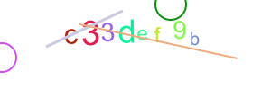

# Captcha-Service
A captcha service to generate random & unique captchas in image form via a HTTP API


<br />

---

<br />


## Example
> In this case the captcha text was "c33def9b".

Captcha image will always be 300 wide and 100 high.




<br />

---

<br />


## API Response
> Refer to this to familiarise yourself with the API's response.

| Property | Example                        | Description                                                                                                                        |
| -------- | ------------------------------ | ---------------------------------------------------------------------------------------------------------------------------------- |
| `image`  | data:image/png;base64,iVBOR... | A data URL containing a representation of the image in the png format. Used to visually present the challenge to the user in HTML. |
| `data`   | iVBOR...                       | A png image buffer converted into base64. Used to visually present the challenge to the user.                                      |
| `text`   | c33def9b                       | The actual text of the captcha that the user needs to enter to pass                                                                |


<br />

---

<br />


## Start

### Install dependencies
```bash
npm install
```

<br />

### Start the server
#### Production
```bash
npm run start
```

#### Development
```bash
npm run start-dev
```
